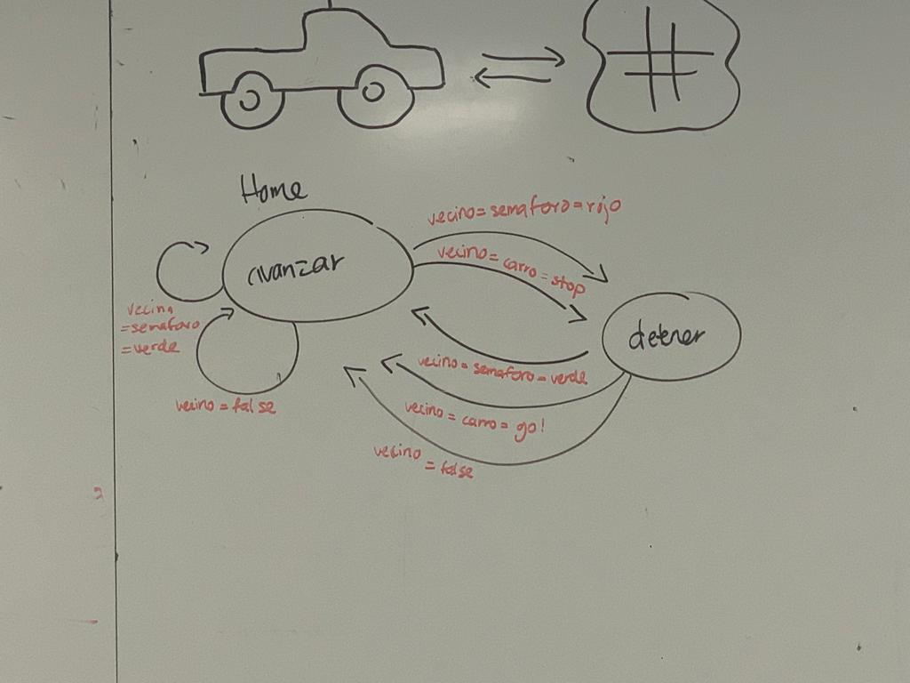

# Revision 1
## Equipo
### Integrantes
Narhari Olalde Guajardo ---- A01284077  
Guillermo Tafoya Milo ------- A01633790  
Mauricio Maqueo Huerta --- A01620649   
Emiliano Yoltic Martinez ---- A01620000   

### Fortalezas y Areas de Oportunidad
|   | Foretalezas  | Areas de Oportunidad  |
|--------------------------|----------------------------------------------------------------------------------------|---|
|  Guillermo Tafoya Milo   | Rapido Aprendizaje   Energetico   Experiencia previa en el area                | Distraccion facil   Procrastinacion   Comunicacion efectiva  |
|  Narhari Olalde Guajardo |  Experiencia previa en el area   Formacion profesional   Pensamiento analítico | Manejo de tiempo   Definir la linea entre trabajo, educacion y tiempo libre   Concentracion |
|  Mauricio Maqueo Huerta  | Inteligencia emocional   Perseverancia   Proactividad                          |Toma de decisiones  Procrastinacion   Manejo de Tiempo |
| Emiliano Yoltic Martinez |  Resiliente   Creativo   Disciplinado                                          | Paciencia   Empatia   Manejo de Estres |

### Expectativas del equipo
- Aprender sobre inteligtencia artificial
- Aprender sobre el desarrollo de software
- Aprender sobre simulaciones
- Aprender sobre desarrollo de assets

### Objetivos -> Compromisos
- Aprender sobre inteligencia artificial -> Lectura de libros, videos, tutoriales, etc.
- Comprension del framework -> Lectura de documentacion y hands on learning
- Relacion entre python y unity -> Video tutoriales, cursos de Udemy, etc.

## Introduccion
En la sociedad actual,la movilidad urbana juega un papel vital en la vida cotidiana y abarca todos los sectores, desde el sector social hasta el industrial y médico, siendo este un tema que ha cobrado gran relevancia en las últimas décadas debido al mayor uso de automóviles y menor uso de los servicios de transporte público, esto más comúnmente representados en las metrópolis. Ejemplo de lo anterior ha sido el incremento en el uso de automóviles en México.

### Antecedentes
Antes que nada es importante definir lo que es la movilidad urbana, la movilidad urbana, se define como la habilidad de transportarse de un lugar a otro  y es fundamental para el desarrollo económico y social y la calidad de vida de los habitantes de una ciudad. Desde hace un tiempo, asociar la movilidad con el uso del automóvil ha sido un signo distintivo de progreso. Sin embargo, esta asociación ya no es posible hoy. El crecimiento y uso indiscriminado del automóvil —que fomenta políticas públicas erróneamente asociadas con la movilidad sostenible—genera efectos negativos enormes en los niveles económico, ambiental y social en México. Como ya se mencionó anteriormente, durante las últimas décadas, ha existido una tendencia alarmante de un incremento en el uso de automóviles en México. Los Kilómetros-Auto Recorridos (VKT por sus siglas en Inglés) se han triplicado, de 106 millones en 1990, a 339 millones en 2010. Ésto se correlaciona simultáneamente con un incremento en los impactos negativos asociados a los autos, como el smog, accidentes, enfermedades y congestión vehicular.

La importancia de este reto reside en que para que México pueda estar entre las economías más grandes del mundo, es necesario mejorar la movilidad en sus ciudades, lo que es crítico para las actividades económicas y la calidad de vida de millones de personas, asimismo este reto nos permitirá contribuir a la solución del problema de movilidad urbana en México, mediante un enfoque que reduzca la congestión vehicular al simular de manera gráfica el tráfico, representando la salida de un sistema multi agentes.

### Situacion Problema
Fue encomendada la tarea de proponer una solución al problema de movilidad urbana en México, mediante un enfoque que reduzca la congestión vehicular al simular de manera gráfica el tráfico, representando la salida de un sistema multi agentes.

Lo anterior se hará mediante la implementación de alguna de los siguientes estrategias:
- Controlar y asignar los espacios de estacionamiento disponible en una zona de la ciudad, evitando así que los autos estén dando vueltas para encontrar estacionamiento.
- Compartir tu vehículo con otras personas. Aumentando la ocupación de los vehículos, reduciría el número de vehículos en las calles.
- Tomar las rutas menos congestionadas. Quizás no más las cortas, pero las rutas con menos tráfico. Más movilidad, menos consumo, menos contaminación.
- Que permita a los semáforos coordinar sus tiempos y, así, reducir la congestión de un cruce. O, quizás, indicar en qué momento un vehículo va a cruzar una intersección y que de esta forma, el semáforo puede determinar el momento y duración de la luz verde.

## Agentes
### Agentes involucrados
- Coches
- Semaforos

### Entorno
- Calles

## Diagramas
### Diagrama de clases

Remplazar por correcto

### Diagrama de protocolos de interaccion

Remplazar por correcto
