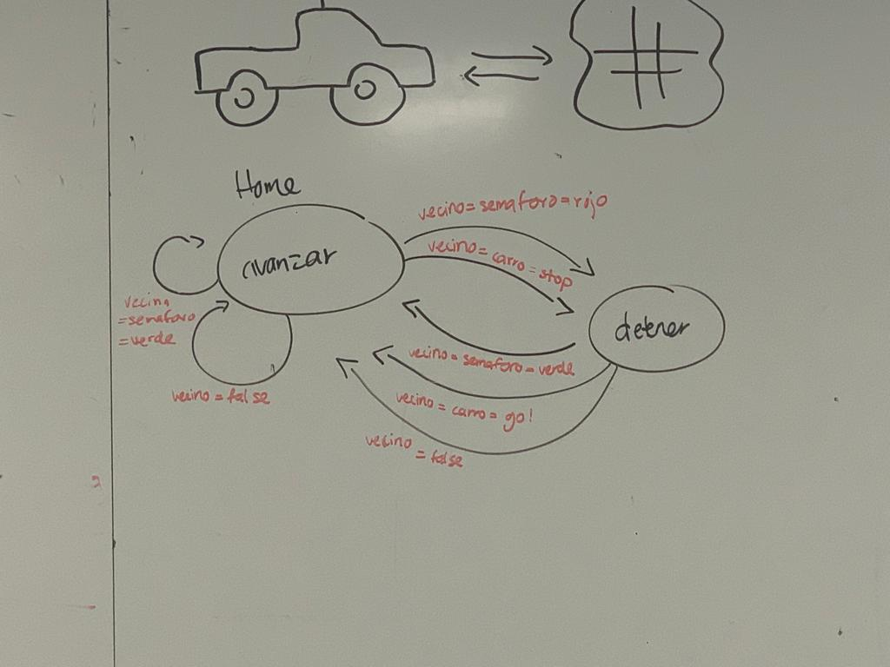

# Revision 2
## Modelacion del sistema de multiagentes necesario para simular una intersección controlada por señales de "Alto"
INSERTAR CODIGO

## Diagrama de protocolos de interaccion
- Diagrama de Carro (Actualizar?)

- Diagrama de semaforo (Actualizar?)
}

## Plan de trabajo
- Sprint 3
  - Establecer el modelo en Unity con Spawn Points y colisiones
  - Codificar interacciones entre las clases en Python
- Sprint 4
  - Interconexión entre Mesa y Unity
  - Bug Hunting y casos de prueba