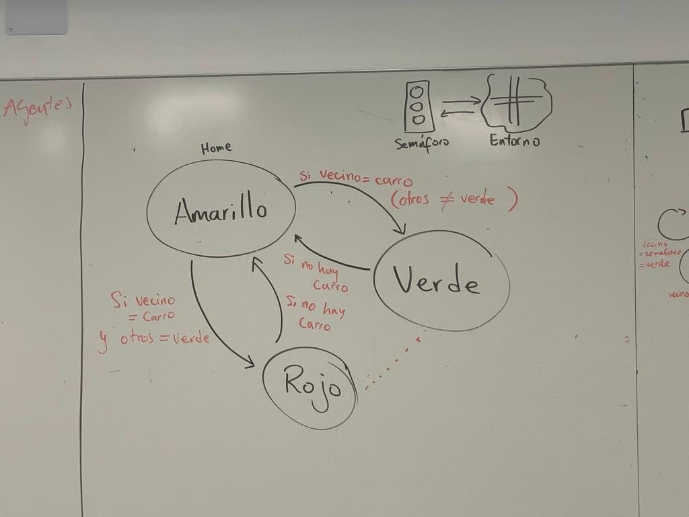

# Revision 3
## Diagramas finales
### Coche

Actualizar
### Semaforo

Actualizar

## Codigo
### Implemento de Agentes

### Implementacion Unity

Actualizar

## Plan de trabajo
- Sprint 4
  - Interconexión entre Mesa y Unity
  - Bug Hunting y casos de prueba